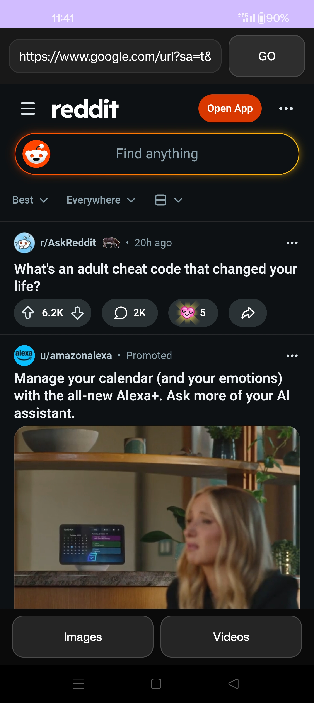

# Insta-Biotch     Instagram Downloader


---

## Minimal. Fast. No bullshit.

Insta-Biotch is a lightweight Android app built to quickly and easily download media from Instagram.

No accounts. No tracking. No ads. No clutter.

Just paste a link and grab what you want.

---

## Features

- Fast Instagram media downloader
- Supports:
  - Images (jpg, jpeg, png, webp, gif)
  - Videos (mp4, webm)
- Simple UI
- No login required
- No ads
- Instant downloads
- Duplicate protection (same URL won't download twice)

---

## How It Works

1. Open the app  
2. Paste an Instagram link  
3. Tap:
   - **Images** → downloads all images  
   - **Videos** → downloads all videos  

That’s it.

Everything downloads immediately.

---

## Download

APK is below in the 'release' section.... 🙄 duh..

---

## Screenshot


---

## Build It Yourself

```bash
git clone https://github.com/ceaserone/Insta-Biotch-Instagram-Dloader.git
cd Insta-Biotch-Instagram-Dloader
./gradlew assembleDebug
```

APK output:
app/build/outputs/apk/debug/app-debug.apk

---

## Philosophy

This app is intentionally minimal.

No bloated UI  
No unnecessary features  
No tracking  
No delays  

Just speed and function.

---

## License

This is under the 'Fuck Society' license...Do whatever you want with it. (Im sure some fuck-tard will add..ads to it and aell it on the playstore, so if you ever see it let me know, and we can reck havok on the mutherfucker!!🤯🤟😜🤔💯)
